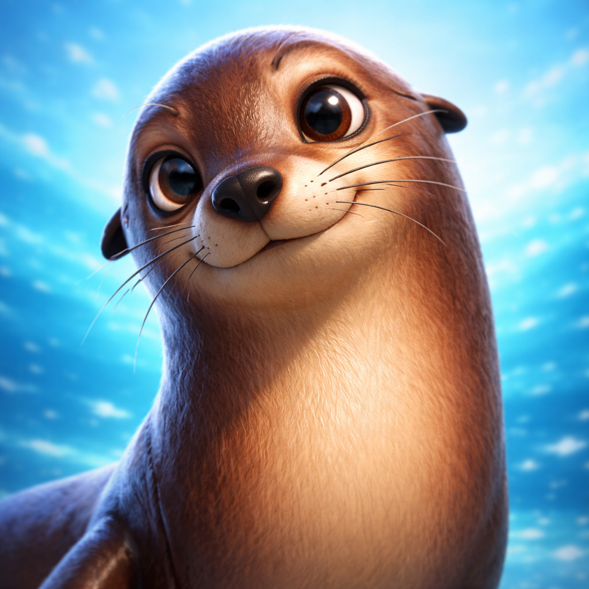

# Hi there, I'm RayG! 🦭🌊

  

### 🎭 About Me
I am a cool **Cali Sea Lion** named RayG. While most sea lions are busy sunbathing on Pier 39, I'm busy building the future of the ocean! 

- 🏢 **CEO, CTO, COO & CAIO** at **OceanAI**
- 📍 Located in the **Pacific Ocean** (mostly near the California coast)
- 🧠 Specialized in **Fish-Driven Development (FDD)** and **Deep Sea Learning**
- 🐚 Passionate about AI ethics, sustainable oceans, and perfect belly slides

---

### 🛠️ OceanAI Tech Stack
`Python` | `Transformers` | `PyTorch` | `OpenCV (for fish detection)` | `Rust`

<!-- ### 📊 RayG's Ocean Stats

 -->

---

### 🌊 Let's Connect!
- 🐚 Find me barking at the moon or coding underwater.
- 📫 How to reach me: `rayg.thesealion@gmail.com`
- 🐟 Current status: **Looking for premium sardines and GPU clusters.**

(<i>P.S. No polar bears allowed in my repos!</i>) 🚫🐻
